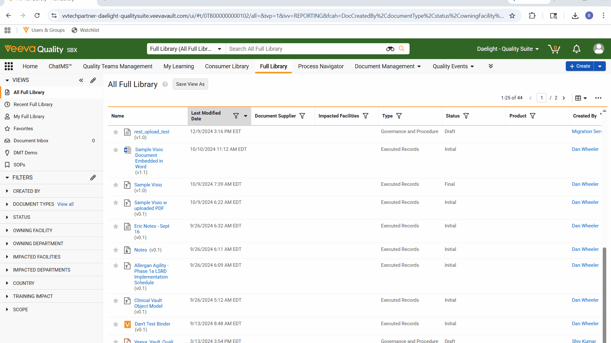

# Vault Steady State Link Copier

Prototype Chrome/Edge extension that adds a "Copy Steady State Link" action to Veeva Vault document menus.

## Demo

## Features

- Adds a new menu item directly under "Copy Link"
- Extracts the current Vault document ID
- Generates a clean steady-state URL
- Copies the link directly to clipboard

## Installation

1. Download the repository
2. Open Chrome or Edge
3. Go to:
   chrome://extensions
4. Enable Developer Mode
5. Click "Load unpacked"
6. Select the extension folder

## Notes

This extension runs entirely locally in the browser and does not collect or transmit data.

Not affiliated with or endorsed by Veeva.